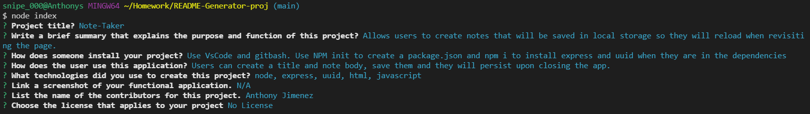

# ReadMe Generator

  ## Table of Contents
  - [Description](#Description)
  - [Installations](#Installations)
  - [Usage](#Usage)
  - [Technologies](#Technologies)
  - [Preview](#Preview)
  - [Contributors](#Contributors)
  - [License](#License)
  ## Description
  Allows users to easily create readme.md files for their projects
  
  ## Installations
  npm i with inquirer in the dependencies

  ## Usage
  node index, then follow the prompts which will fill in their readme.

  ## Technologies
  node, javascript, inquirer

  ## Preview
  

  ## Contributors
  Anthony Jimenez

  ## License
  
   
  This application uses MIT license. 
